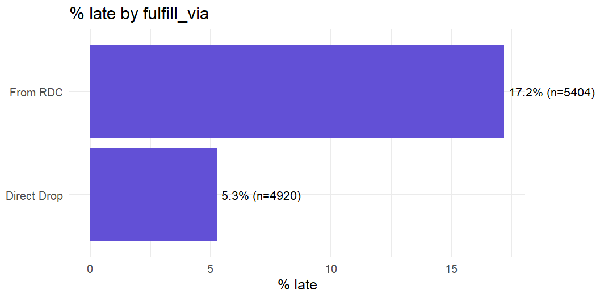
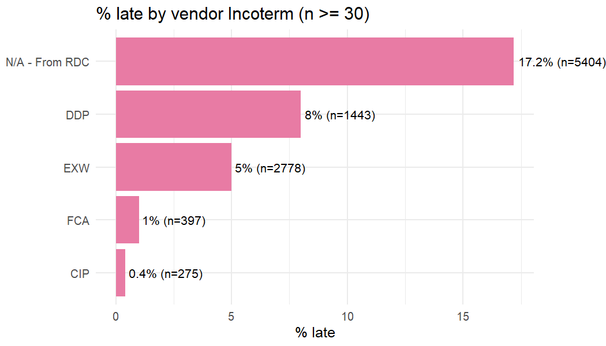
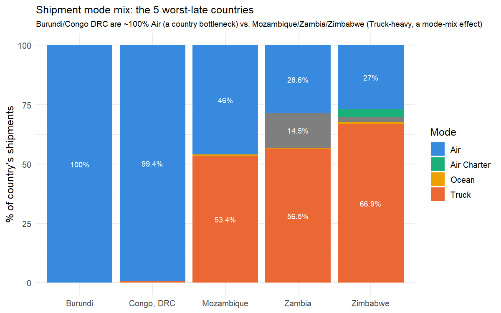
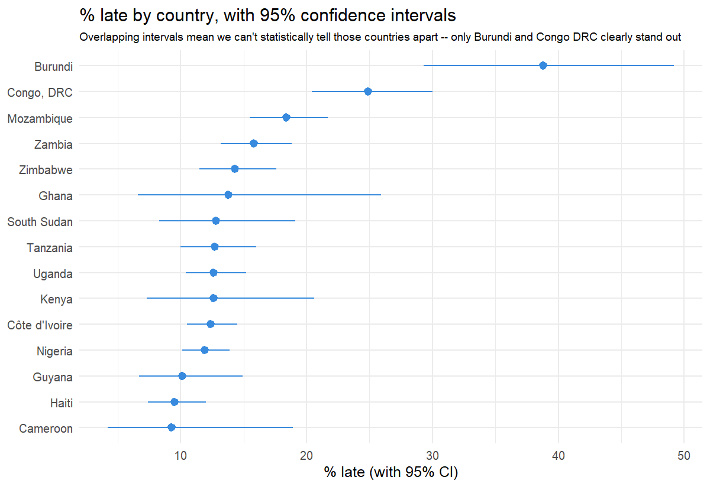
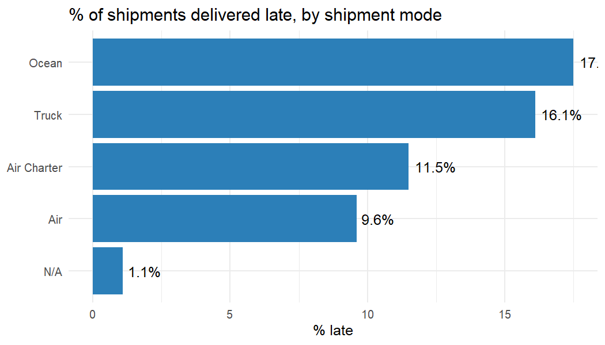
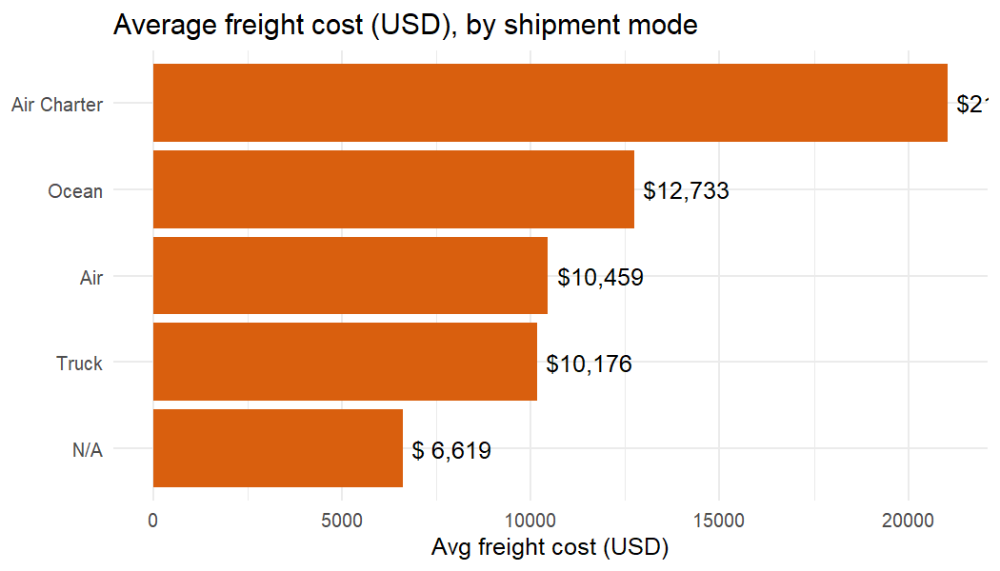
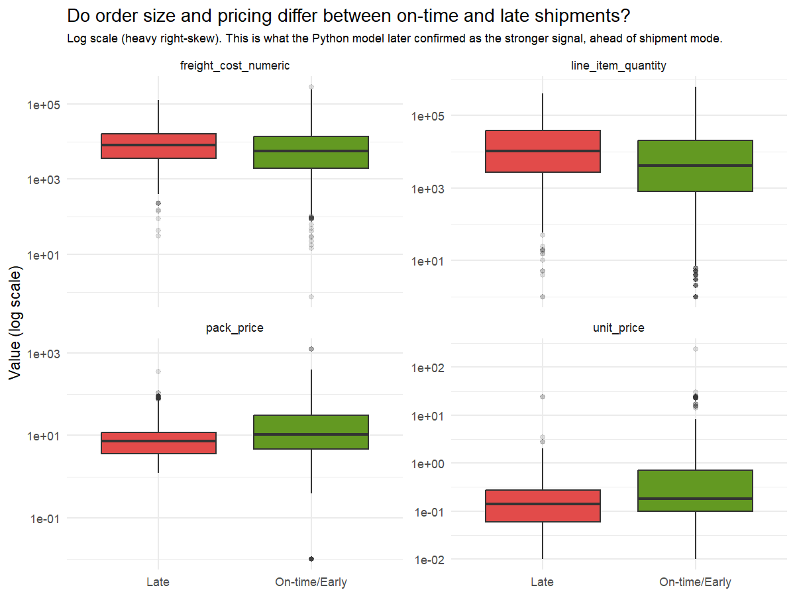
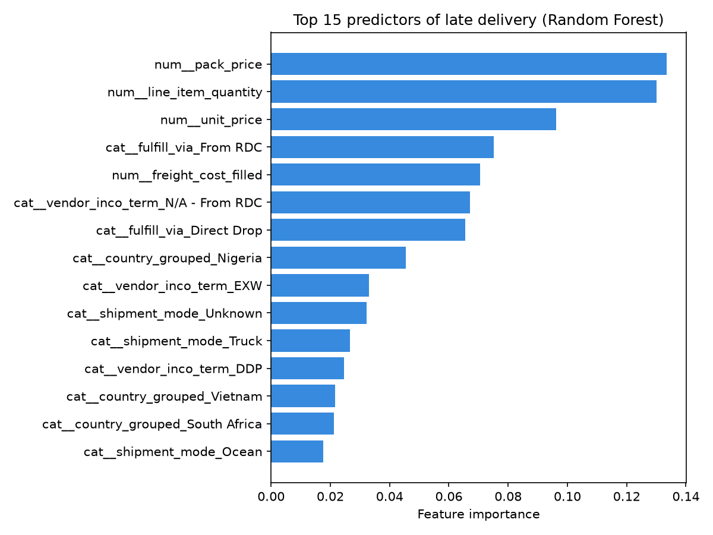
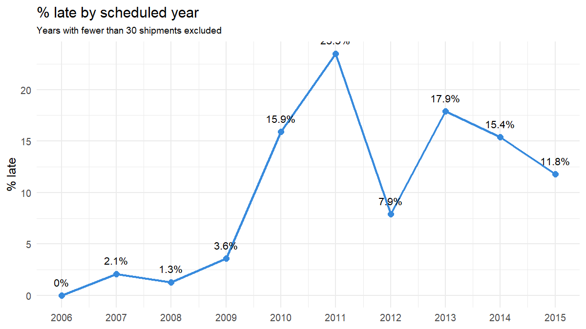

# Delivery Performance Review: USAID Supply Chain Shipment Data

**Prepared by:** Chigozie Nkwopara
**Dataset:** USAID Supply Chain Shipment Pricing Data (SCMS Delivery History, 2006–2015) — 10,324 shipments of HIV/ARV health commodities to 43 countries
**Tools used:** R (exploratory analysis, statistical testing), SQL (data validation, KPI queries), Power BI (dashboard), Python/scikit-learn (predictive model)

---

## Executive summary

Across 10,324 shipments, **11.5% arrived late**. The strongest, most actionable driver isn't shipment mode or destination country — it's **how the shipment was fulfilled**. Shipments routed through a Regional Distribution Center (RDC) with no clearly defined Incoterm were late **17.2% of the time**, versus **5.3%** for shipments sent Direct Drop from the vendor — a **3.2x difference** on two large, comparably-sized samples (5,404 vs. 4,920 shipments). That single factor outweighs everything else examined in this analysis and should be the first place operational attention goes.

## Key findings

**1. Fulfilment route is the biggest lever found — bigger than shipment mode or country.**
| Fulfilment route | % late | n |
|---|---|---|
| From RDC | 17.2% | 5,404 |
| Direct Drop | 5.3% | 4,920 |

This is reinforced by the Incoterm breakdown: routes with a clearly defined, vendor-responsible Incoterm (CIP 0.4% late, FCA 1% late) perform far better than the undefined "N/A – From RDC" bucket (17.2% late).

  
  

**2. Country-level lateness splits into two distinct problems requiring two different fixes.**
- **Burundi (38.8% late) and Congo, DRC (24.9% late)** ship almost entirely by Air — the most reliable mode overall — yet are still the worst performers. Confidence intervals confirm these two are *statistically* distinct from every other country in the dataset. This points to an in-country bottleneck (customs, last-mile handling), not a shipping-method problem.
- **Mozambique, Zambia, and Zimbabwe** lean heavily on Truck (53–67% of their shipments), and Truck is already the second-worst mode everywhere (16.1% late). Their elevated lateness is largely just this mode-mix effect.
- Below the top two, most of the "top 15 worst countries" ranking is statistical noise — Ghana's 95% confidence interval (6.6%–25.9%) overlaps a dozen other countries, so its precise rank shouldn't be treated as reliable.

  
  

**3. Shipment mode is a genuine cost-vs-speed trade-off, not a simple ranking.**
Air Charter costs roughly double standard Air ($21,052 vs. $10,459 average freight) but is delivered *ahead* of schedule on average — it's a legitimate option for time-critical shipments, not a wasteful one. Ocean and Truck are both cheaper and slower/less reliable (17.5% and 16.1% late respectively).

  
  

**4. Large, low-unit-cost bulk orders are more likely to be late.**
Late shipments have a median quantity 2.5x higher than on-time ones (10,424 vs. 4,122 units) and a lower unit price ($0.14 vs. $0.18) — consistent with large bulk orders facing more logistics/customs friction. A Random Forest model built on this data confirms order size and fulfilment route outrank shipment mode as predictors (ROC-AUC 0.82, catching 89% of shipments that go on to be late).

  
  

**5. Delivery performance took a sharp, sustained turn for the worse starting in 2010.**
Late rate was near-zero from 2006–2009 (0–3.6%), then jumped to 15.9% in 2010 and has stayed elevated (8–24%) every year since. This timing is consistent with — though not confirmed by this dataset alone — an expansion of RDC-based fulfilment around the same period.

## Recommendations

1. **Audit the "From RDC / undefined Incoterm" fulfilment path first.** It's the single largest, cleanest lever in this dataset. Determine what breaks down in the RDC handoff, and formalize an Incoterm for every RDC-routed shipment rather than leaving it undefined.
2. **For Mozambique, Zambia, and Zimbabwe:** shift a larger share of volume from Truck to Air where budget allows — this is the same lever that already works well everywhere else.
3. **For Burundi and Congo, DRC:** investigate in-country customs and last-mile handling specifically. Switching shipment mode won't help here, since both countries are already almost entirely Air.
4. **Investigate the 2010 shift directly** — pull internal records on when RDC-based fulfilment scaled up, and test whether it lines up with the jump in late deliveries.
5. **Use the predictive model as a triage tool**, not a gatekeeper: flag large-quantity, low-unit-price, RDC-routed shipments for proactive monitoring before they ship, rather than trying to block them outright (the model's precision is intentionally low — 23% — because it was tuned to catch as many true late shipments as possible, at the cost of some false alarms).

## Caveats and limitations

- This is observational data — the `fulfill_via` finding is a strong association, not proven causation. A controlled before/after comparison (or a pilot on a subset of RDC routes) would be needed before committing to a large process change.
- Freight cost figures are based on the 60% of shipments with a usable numeric cost field; the remaining 40% used different cost-accounting categories (e.g. "Freight Included in Commodity Cost") and were excluded rather than estimated.
- The 2010 structural break is a well-supported hypothesis, not a confirmed cause — this dataset has no field recording when RDC fulfilment was introduced or scaled.
- Country rankings beyond Burundi and Congo, DRC should be read with their confidence intervals in mind, not as a precise ordering.

---
*Full analysis, code, and validation trail: `eda.R` (R, 16 steps), `sql/` (6 SQL scripts, includes a caught data-integrity bug), `predict_late_deliveries.py` (Python/scikit-learn), and the Power BI dashboard (`powerbi/`). All headline figures in this memo were independently cross-validated across at least two of these four tools.*
